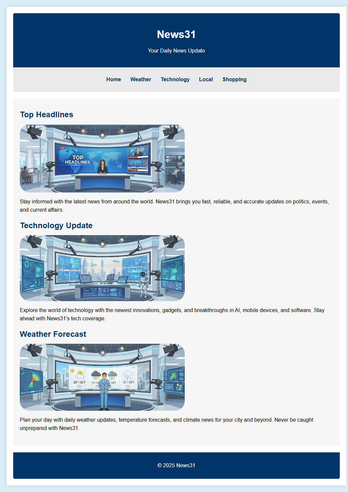
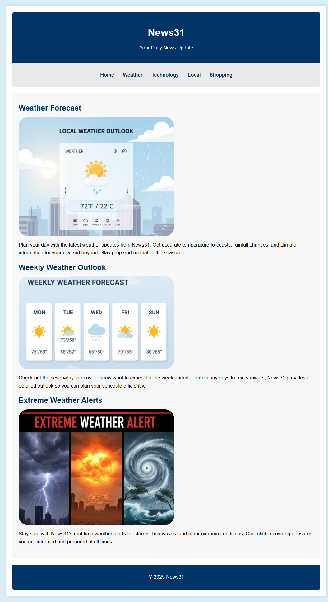
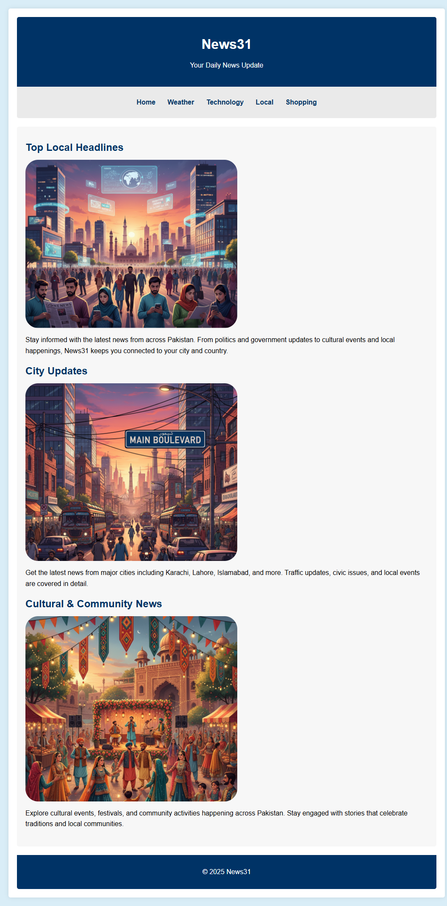
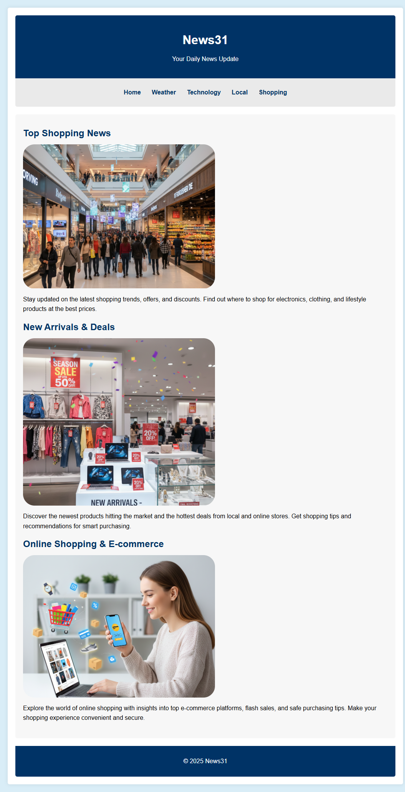

# News31 Website Project

**News31** is a multipage news website that provides daily updates on general news, weather, technology, local events, and shopping.

## Features

- Clear navigation bar for easy access to all sections.
- Each page contains images, headings, and descriptive text.
- Consistent design and color theme for a professional look.

## Pages 

1. **Home Page**  
   Displays top headlines, technology updates, and weather highlights.  
   

2. **Weather Page**  
   Provides daily, weekly, and extreme weather updates with images.  
   

3. **Technology Page**  
   Covers latest tech news, gadget reviews, software updates, and future innovations.  
   

4. **Local Page**  
   Focuses on Pakistani local news including city updates and cultural events.  
   

5. **Shopping Page**  
   Displays shopping news, new arrivals, deals, and online shopping trends.  
   


## How to Run

1. Clone the repository using Git:

```bash
git clone https://github.com/ali4129944-cs/News31-Website.git
```

2. Navigate to the project folder:

```bash
cd News31-Website
```

3. Open `index.html` in any web browser to start exploring News31.
4. Use the menu bar to navigate to other pages (Weather, Technology, Local, Shopping).

## Technologies Used

- HTML5
- CSS3
- Simple, clean layout with images

